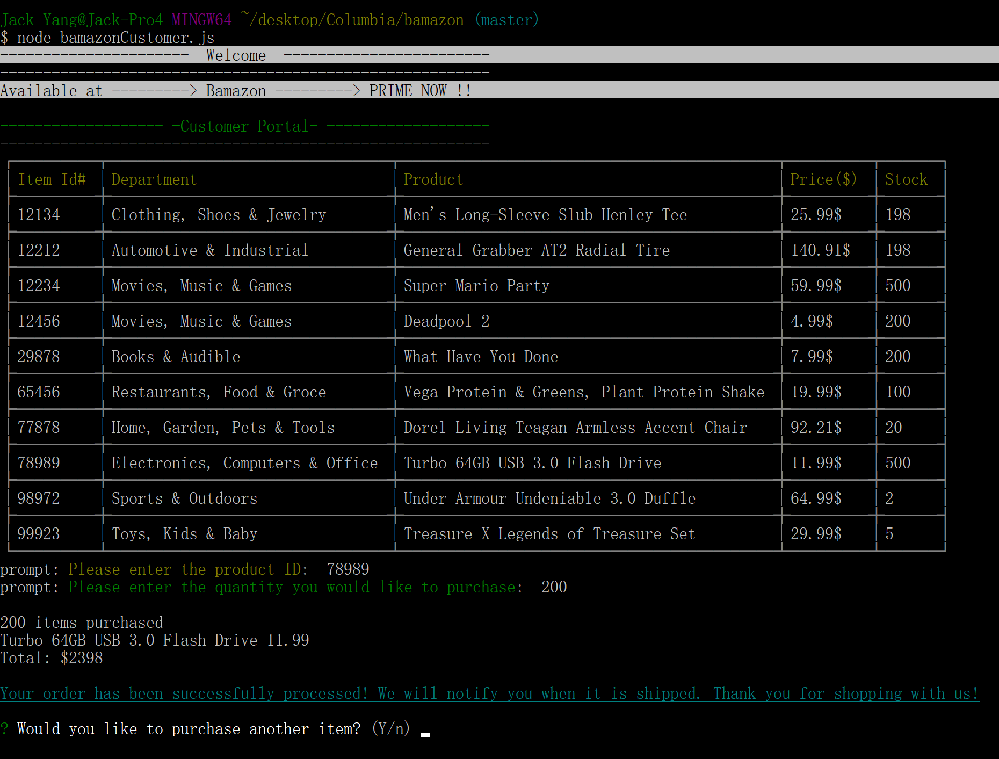

# Bamazon

## Introducing Bamazon...
 

This is an interactive shopping node app using MySQL and Node.JS. It allows the customer to place an order, the manager to view, track and update the product inventory, and the executive to create a new department and track the total sales by department.

### How to Use?
1. Install necessary packages: 

* npm `install mysql`
* npm `install prompt`
* npm `install inquirer`
* npm `install colors`
* npm `install cli-table`
    
2. Type `node bamazonCustomer`, or `node bamazonManager`, or `node bamazonSupervisor`
 
## Bamazon Customer Portal
 

Running the Customer Portal will first display all of the items available for sale. Include the ids, names, and prices of products for sale. Then it will prompt users with two messages.

   * The first should ask them the ID of the product they would like to buy.
   * The second message should ask how many units of the product they would like to buy.

Once the customer has placed the order, it will check if the store has enough of the product to meet the customer's request.

   * If not, the app will prevent the order from going through.

## Bamazon Manager Portal
 

The Bamazon Customer Portal allows users to view and edit the inventory of the store.  The user will be prompted to choose from the following options:
* View products for sale
* View low inventory
* Add to inventory
* Add a new product

* If a manager selects `View Products for Sale`, the app will list every available item: the item IDs, names, prices, and quantities.
* If a manager selects `View Low Inventory`, then it will list all items with an inventory count lower than five.
* If a manager selects `Add to Inventory`, the app will display a prompt that will let the manager "add more" of any item currently in the store.
* If a manager selects `Add New Product`, it will allow the manager to add a completely new product to the store.

## Bamazon Executive Portal
 

The Bamazon Executive Portal allows users to view the total profits of the store categorized by department and add new departments. When a supervisor selects `View Product Sales by Department`, the app will display a summarized table in their terminal/bash window. The `total_profit` column will be calculated on the fly using the difference between `over_head_costs` and `product_sales`. 

